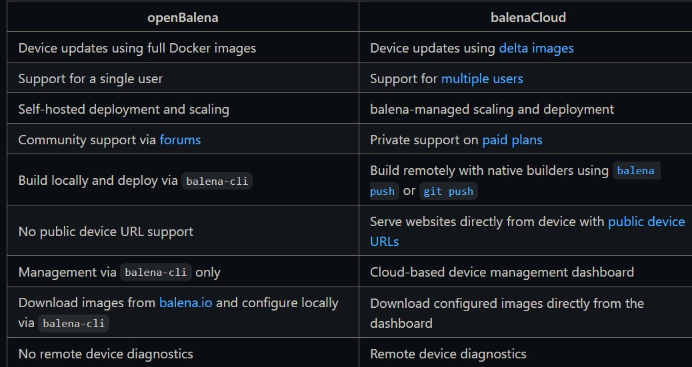

# Docker Swarm vs. Balena

## DOCKER SWARM

### What is the Docker Swarm?
Docker Swarm is a tool for managing a cluster of Docker containers. It allows you to turn a group of Docker hosts into a single virtual server.

Docker Swarm can be used for IoT fleet management. Some of the advantages of using Docker Swarm for IoT fleet management are:

- Easy and flexible installation
- Clear dashboard
- Great scaling operations
- Monitoring is an integral part
- Great load balancing concepts
- Monitors the condition and ensures compensation in the event of failure
- Simplified cluster management
- Improved resource utilization
- High availability
- Automatic load balancing
- Multi-cloud support
- Cost reduction
- Increased application availability

### Advantages:

Docker Swarm has several advantages for IoT fleet management. Here are some of them:

Easy deployment: Docker Swarm is easy to deploy and fast to install. It comes with Docker Engine by default and can be easily integrated with Docker CLI and Docker Compose.

High availability: One of the main benefits of Docker Swarms is increasing application availability through redundancy. By implementing multiple managers, developers ensure that the system can continue to function even if one of the manager nodes fails.

Ease of use: Docker Swarm is deployed with the Docker Engine and is readily available in your environment. As a result, Swarm is easier to start with, and it may be more ideal for smaller workloads.

### Disadvantages:
There are several disadvantages of Docker Swarm that are mentioned below:

Not suitable for complex infrastructures.
Customization in Docker Swarm is limited.
Due to the tie-in with the Docker API, the functionality of this platform is limited.
Community is smaller as compared to other platforms.

### How does Docker Swarm handle scaling of IoT applications?
   Docker Swarm can handle scaling of IoT applications by changing the desired state of the service running in the swarm. You can run the following command to change the desired state of the service running in the swarm: $ docker service scale <SERVICE-ID>=<NUMBER-OF-TASKS>. For example: $ docker service scale helloworld=5. This will scale the helloworld service to 5.

### How does Docker Swarm handle load balancing in IoT deployments?
   Docker Swarm uses ingress load balancing to expose the services you want to make available externally to the swarm. The swarm manager can automatically assign the service a PublishedPort or you can configure a PublishedPort for the service. You can specify any unused port.

### Difference between Balena and Docker Swarm:
   Balena is a moby compatible container engine ("Docker") with some optimizations regarding memory usage, less writes to the hard drive / sd card to prolong media life, Delta Updates to Images etc. The biggest drawback are the removal of the plugin interface - and hence Docker Swarm and K8s compatibility.

### Using Docker Swarm for management and updating on several machines
   You can run a swarm of Docker Engines and manager nodes are the key components for managing the swarm and storing the swarm state. It is important to understand some key features of manager nodes to properly deploy and maintain the swarm.

   You can use Docker Swarm to quickly deploy a cluster of Docker hosts running either on your local machine or on supported cloud platforms.

### I have 1000 machines and these machines are divided into 4 groups. Can I use Docker Swarm in this situation?
   Yes, you can use Docker Swarm for this situation. Docker Swarm is a native clustering tool for Docker that allows you to turn a group of Docker hosts into a single virtual server.

### How to use Docker Swarm in IoT Fleet Management?
Docker swarm is a feature of Docker Engine that allows you to create and manage a cluster of Docker nodes. You can use Docker swarm to deploy and scale your applications across multiple nodes in a swarm. Docker swarm also provides features such as service discovery, load balancing, and network overlay.
To use Docker swarm in IoT fleet management, you need to:
Install Docker Engine on each node that you want to join the swarm. See installation instructions for all operating systems and platforms.

Initialize a swarm on one of the nodes, and specify the --advertise-addr flag to advertise your address to other nodes in the swarm. For example: docker swarm init --advertise-addr 192.168.1.100.

Join other nodes to the swarm as either managers or workers, using the docker swarm join command with the token generated by the docker swarm init command. For example: docker swarm join --token SWMTKN-1-49nj1cmql0jkz5s954yi3oex3nedyz0fb0xx14ie39trti4wxv-8vxv8rssmk743ojnwacrr2e7c 192.168.1.100:2377.

Create an overlay network for your services, using the docker network create command with the --driver overlay option. For example: docker network create --driver overlay my-net.

Deploy your services to the swarm, using the docker service create command with the --network option to attach them to the overlay network. You can also specify other options such as --replicas, --constraint, or --publish to configure the number, placement, and port mapping of your service tasks. For example: docker service create --name my-service --network my-net --replicas 3 --publish 80:80 my-image.

Monitor and update your services as needed, using commands such as docker service ls, docker service ps, docker service scale, or docker service update.

### BeagleBone in Docker Swarm without SSH Connection

If you do not want to use ssh connection for connecting beaglebones with docker swarm, you may try some of these alternatives:
Use docker context or docker --host commands to run docker commands on remote nodes via ssh protocol without logging in. You need to have key-based authentication set up for this to work. For example: docker context create --docker host=ssh://user@beaglebone1 beaglebone1 or docker --host ssh://user@beaglebone1 ps -a.

Use docker machine to create and manage remote nodes with docker engine installed and configured. Docker machines can also automate the process of setting up TLS certificates and keys for secure communication. For example: docker-machine create --driver generic --generic-ip-address=beaglebone1 --generic-ssh-user=user beaglebone1.

Use an SSH tunnel to forward a local port to the remote docker socket. You need to have ssh access to the remote node for this to work. For example: ssh -fNL localhost:2375:/var/run/docker.sock user@beaglebone1 and then export DOCKER_HOST=localhost:2375.

Use a VPN or a proxy service to connect to the remote nodes over a secure network. You need to have a VPN or a proxy server setup for this to work. For example: docker -H tcp://beaglebone1:2375 ps -a.

## BALENA

What is the Balena?
   Balena is a complete set of tools for building, deploying, and managing fleets of connected Linux devices. It is a secure container-based technology stack that enables you to develop, deploy, manage, and scale fleets of IoT Linux devices.

   The balena ecosystem allows you to manage multiple edge devices straight from a single dashboard (balenaCloud), and adding a new device to an existing fleet is extremely straightforward.

Some of the advantages of using Balena for IoT fleet management are:

- Secure container-based technology stack
- Comprehensive device deployment and management infrastructure
- Develop, deploy, manage and scale your IoT business
- Manage massive fleets of small IoT Linux devices with balena’s IoT management cloud platform

### Advantages:

Some of the advantages of using Balena for IoT fleet management are:

Balena’s device management platform streamlines the application lifetime process by providing tools for remote application deployment and management. It enables you to easily manage your fleet of IIoT gateways from a central location.

Efficient industrial application deployment cycles with balena using CI/CD on your IT to benefit your OT.
Improved security with continuous kernel upgrades to balenaOS images, secure boot and full disk encryption.
Manage massive fleets of small IoT Linux devices with balena’s IoT management cloud platform.

### How does Balena handle scaling of IoT applications?
   Balena enables you to scale your IoT applications by providing a complete set of tools for building, deploying, and managing fleets of connected Linux devices. You can manage massive fleets of small IoT Linux devices with balena’s IoT management cloud platform. You can also solve real-world physical computing challenges immediately with ready-to-deploy applications that run directly on fleets of small devices.

### How does Balena handle load balancing in IoT deployments?
   Balena does not provide load balancing for IoT deployments out of the box, but it allows you to implement your own load balancing solution using its features and tools. Here are some possible ways to do that:
Use balenaCloud or openBalena: These are cloud platforms that enable you to manage your IoT fleet remotely. You can use them to deploy, update, monitor, and troubleshoot your devices. You can also use their APIs and SDKs to customize your workflow and integrate with other services.

Use balenaOS and balenaEngine: These are the core components of balena’s container-based technology stack. balenaOS is a lightweight Linux distribution that runs on your devices and supports various hardware architectures. balenaEngine is a container engine optimized for IoT devices that runs your application containers. You can use these components to run your own load balancing software on your devices, such as HAProxy, Nginx, or Traefik.

Use Deploy with Balena: This is a feature that allows you to deploy and share IoT applications with a single click. You can use it to create a button that links to your GitHub repository and automatically deploys your application to any device running balenaOS. You can also use it to discover and deploy existing IoT applications from the balenaHub community.

### Using Balena for management and updating on several machines
   Balena provides a platform to deploy and manage connected devices. You can use the Balena CLI to configure your application containers, push updates, check status, view logs, and so forth. Balena deploy is functionally very similar to balena push but avoids pushing any source code to the balenaCloud build server. It gives more control over how and where your container images are built, allowing for Balena deploy to be integrated into your own CI/CD build system.

### What is the openBalena?
Open balena is a platform to deploy and manage connected devices. Devices run balenaOS, a host operating system designed for running containers on IoT devices, and are managed via the balena CLI, which you can use to configure your application containers, push updates, check status, view logs, and so forth.

Open balena’s backend services, composed of battle-tested components that we’ve run in production on balenaCloud for years, can store device information securely and reliably, allow remote management via a built-in VPN service, and efficiently distribute container images to your devices.

With open balena, we want to give developers the ability to manage fleets of devices on their own. One of our primary motivations in releasing open balena is to mitigate fears of lock-in and remove barriers to exit (and entry!). We also hope to encourage contributions to the codebase so that users can fix issues and add features themselves. We will continue evolving open balena in lockstep with balenaCloud, with much of our development process taking place in the open, so that together we can keep improving both the open source project and the hosted service.

### openBalena vs balenaCloud

### Conclusion:

   Docker Swarm and Balena are both tools for managing containers, but they have different features and use cases. Docker Swarm is a native clustering solution for Docker that allows you to create and manage a swarm of Docker nodes. Balena is a container engine optimized for IoT devices that integrates with balenaCloud or openBalena for remote device management. Here are some of the main differences between them:

- Docker Swarm supports plugins, load balancing, service discovery, ingress, self-healing, storage orchestration, horizontal scaling, and automated rollouts/rollbacks. It is suitable for complex applications that require high availability and scalability. It is compatible with Kubernetes and other CNCF projects.

- Balena reduces memory usage, disk writes, and image size for containers. It enables delta updates, device health checks, VPN access, and fleet-wide actions. It is designed for IoT applications that run on single board computers like Raspberry Pi. It does not support Swarm or Kubernetes clusters.

   In conclusion, Docker Swarm and balena are both powerful tools for container management, but they target different scenarios and have different trade-offs. You should choose the one that best fits your needs and goals.

### IoT Fleet Softwares:

AWS IoT FleetWise: A cloud-based service that collects, transforms, and transfers vehicle data to the cloud in near real time. It allows you to analyze standardized data from a fleet of vehicles without developing a custom data collection system.

Safecube: A solution that enables real-time visibility and optimization of container shipments. It uses IoT sensors, cloud computing, and data analytics to provide information on location, temperature, humidity, shocks, and door openings.

Upswift: Upswift is the first Plug&Play, ready-to-use, device management platform for connected products. The docs include guides & information that will help you deploy and manage thousands of devices easily.

EdgeIQ: EThe DeviceOps Platform for managing devices, data, software, cloud integrations and powerful business workflows.

Cumulocity IoT Platform: We know IoT projects can be complicated. That's why the Cumulocity IoT platform simplifies things for you with self-service tools and a configuration-driven approach. Cumulocity IoT is a leading self-service IoT platform, top rated by independent analysts, with fast ROI.

## REFERENCES

https://stackoverflow.com/questions/41175073/running-code-without-ssh-in-beaglebone-black https://stackoverflow.com/questions/44056501/how-can-i-remotely-connect-to-docker-swarm https://www.digitalocean.com/community/tutorials/how-to-create-a-cluster-of-docker-containers-with-docker-swarm-and-digitalocean-on-ubuntu-16-04 
https://unix.stackexchange.com/questions/703586/ssh-connect-to-a-docker-container-directly-without-ssh-the-host-first 
https://docs.docker.com/engine/swarm/admin_guide/ 
https://docs.docker.com/engine/swarm/ 
https://docs.docker.com/engine/swarm/services/ 
https://www.ibm.com/cloud/learn/docker-swarm 
https://docs.docker.com/engine/swarm/ 
https://docs.docker.com/engine/swarm/networking/ 
https://stackshare.io/stackups/balena-vs-docker-swarm-vs-kubernetes
https://www.balena.io/ 
https://www.balena.io/cloud  
https://www.balena.io/blog/build-an-environment-and-air-quality-monitor-with-raspberry-pi/ https://www.balena.io/blog/make-a-web-frame-with-raspberry-pi-in-30-minutes/ 
https://www.balena.io/docs/learn/getting-started/
https://www.balena.io/open
https://github.com/balena-io/open-balena
https://zhuanlan.zhihu.com/p/349867272
